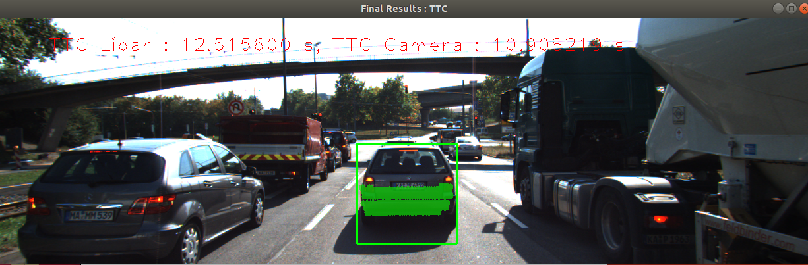
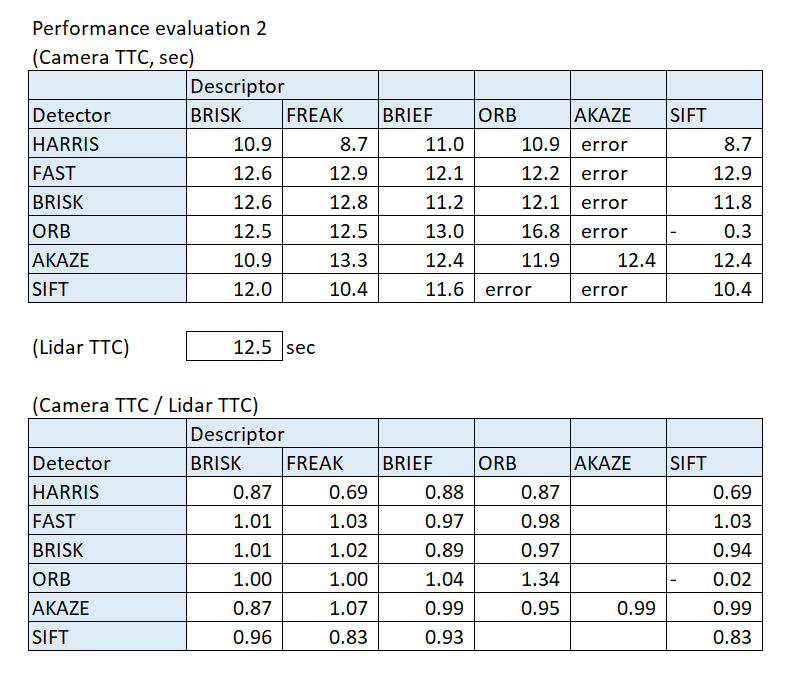

# SFND 3D Object Tracking

Welcome to the final project of the camera course. By completing all the lessons, you now have a solid understanding of keypoint detectors, descriptors, and methods to match them between successive images. Also, you know how to detect objects in an image using the YOLO deep-learning framework. And finally, you know how to associate regions in a camera image with Lidar points in 3D space. Let's take a look at our program schematic to see what we already have accomplished and what's still missing.

In this final project, you will implement the missing parts in the schematic. To do this, you will complete four major tasks: 
1. First, you will develop a way to match 3D objects over time by using keypoint correspondences. 
2. Second, you will compute the TTC based on Lidar measurements. 
3. You will then proceed to do the same using the camera, which requires to first associate keypoint matches to regions of interest and then to compute the TTC based on those matches. 
4. And lastly, you will conduct various tests with the framework. Your goal is to identify the most suitable detector/descriptor combination for TTC estimation and also to search for problems that can lead to faulty measurements by the camera or Lidar sensor. In the last course of this Nanodegree, you will learn about the Kalman filter, which is a great way to combine the two independent TTC measurements into an improved version which is much more reliable than a single sensor alone can be. But before we think about such things, let us focus on your final project in the camera course. 

## Dependencies for Running Locally
* cmake >= 2.8
  * All OSes: [click here for installation instructions](https://cmake.org/install/)
* make >= 4.1 (Linux, Mac), 3.81 (Windows)
  * Linux: make is installed by default on most Linux distros
  * Mac: [install Xcode command line tools to get make](https://developer.apple.com/xcode/features/)
  * Windows: [Click here for installation instructions](http://gnuwin32.sourceforge.net/packages/make.htm)
* Git LFS
  * Weight files are handled using [LFS](https://git-lfs.github.com/)
* OpenCV >= 4.1
  * This must be compiled from source using the `-D OPENCV_ENABLE_NONFREE=ON` cmake flag for testing the SIFT and SURF detectors.
  * The OpenCV 4.1.0 source code can be found [here](https://github.com/opencv/opencv/tree/4.1.0)
* gcc/g++ >= 5.4
  * Linux: gcc / g++ is installed by default on most Linux distros
  * Mac: same deal as make - [install Xcode command line tools](https://developer.apple.com/xcode/features/)
  * Windows: recommend using [MinGW](http://www.mingw.org/)

## Basic Build Instructions

1. Clone this repo.
2. Make a build directory in the top level project directory: `mkdir build && cd build`
3. Compile: `cmake .. && make`
4. Run it: `./3D_object_tracking`.

# Results

## Screenshot 

## Performance Evaluation 

### Evaluation 1

Followings are the TTC from Lidar, for the first 18 frames. There is no problem found, and the results are stable. 

- d0:8.074  d1: 8.01  frameRate: 10  TTC:12.5156
- d0:8.01  d1: 7.947  frameRate: 10  TTC:12.6142
- d0:7.947  d1: 7.891  frameRate: 10  TTC:14.091
- d0:7.891  d1: 7.844  frameRate: 10  TTC:16.6894
- d0:7.844  d1: 7.795  frameRate: 10  TTC:15.9082
- d0:7.795  d1: 7.734  frameRate: 10  TTC:12.6787
- d0:7.734  d1: 7.67  frameRate: 10  TTC:11.9844
- d0:7.67  d1: 7.612  frameRate: 10  TTC:13.1241
- d0:7.612  d1: 7.554  frameRate: 10  TTC:13.0241
- d0:7.554  d1: 7.487  frameRate: 10  TTC:11.1746
- d0:7.487  d1: 7.429  frameRate: 10  TTC:12.8086
- d0:7.429  d1: 7.347  frameRate: 10  TTC:8.95978
- d0:7.347  d1: 7.274  frameRate: 10  TTC:9.96439
- d0:7.274  d1: 7.199  frameRate: 10  TTC:9.59863
- d0:7.199  d1: 7.116  frameRate: 10  TTC:8.57352
- d0:7.116  d1: 7.042  frameRate: 10  TTC:9.51617
- d0:7.042  d1: 6.969  frameRate: 10  TTC:9.54658
- d0:6.969  d1: 6.887  frameRate: 10  TTC:8.3988

### Evaluation 2

Followings is the result of Camera TTC, using the first and second frames. 
Seeing from this, it is found that Camera TTC results are generally close to the TTC results of Lidar. 
There seems to be difference of performance between detectors. As a initial understandings from this limited samples, it can be found that FAST/BRISK/ORB detectors work well, while HARRIS's performance is not good (tends to calculate shorter TTC)
 

